# single-harness — architecture

The authoritative map. Every claim here is traceable to a function in `harness/`.

---

## 1. The system

```mermaid
flowchart TB
    IN[["papers/*.pdf<br/><i>run.py review --paper a b c</i>"]]

    subgraph DRIVER["CONTROLLER — harness/controller.py"]
        STEP["step() · one phase, one PhaseEvent"]
        DRIVE["drive() → terminal or waiting<br/>drive_all() → round-robin over papers"]
        CS[("projects/&lt;pid&gt;/controller.json<br/>phase · status · attempts · history")]
    end

    subgraph S1["S1 INGEST — stages/ingest.py"]
        ING["run_ingest()<br/>pdf.py → sections · tables · numbers<br/>repo.official_repo_url()<br/>content_sha = paper identity"]
        DOC[("paper/doc.json")]
    end

    subgraph S2["S2 AUDIT — stages/audit.py · the only model stage"]
        RA["run_audit() writes 4 prompts. Calls no model."]
        AD["audit_driver.run_lens() ×4<br/>one subprocess per lens · staged, then promoted"]
        LJ[("audit/&lt;lens&gt;.json ×4")]
        VE["load_reports() → verify_evidence()<br/><b>harness writes verified_observation + evidence_class</b>"]
    end

    subgraph S2B["S2b DISCOVER — stages/discover.py · no model, pure"]
        CL["claims.mint() · a lens supplies the QUOTE,<br/>the harness mints the ADDRESS"]
        QS["questions.derive() · finding → answerable question"]
        DS["discovery.discover() · what is addressable,<br/>and how central — from STRUCTURE"]
        PR["priority.order() · centrality ▸ addressability ▸<br/>decisiveness ▸ identity ▸ artifact ▸ cost"]
        PL{{"planner.plan()<br/>cheap route first · escalate only if justified<br/>NO_EXPERIMENT · PAPER_ONLY · AUTHOR_CODE<br/>RECONSTRUCTION · VALIDATION · INFEASIBLE_*"}}
        TS[("discovery/targets.json<br/>objects · questions · plans · outcomes")]
    end

    subgraph S3["S3 VERIFY — stages/probe.py · per target, up to SH_MAX_TARGETS"]
        ACQ["repo.acquire(revision=audited_commit)"]
        CA["code_audit.audit_repo() · AST only, never FATAL"]
        SYN["probe_synth.plan() → runs/&lt;pid&gt;/probe.py"]
        PE["plan_execution() — assess always, promote only if permitted"]
        CHK["repo.verify_commit · experiment_id.resolve<br/>resources.assess · backend.capability<br/>backends.select_for"]
    end

    subgraph EX["EXECUTE — backends.py + local_exec.py"]
        AUTH{{"authorize()<br/>gate · backend · provenance · commit<br/>· identity · capability · resources"}}
        RUN["backend.execute() per (seed, arm)"]
    end

    REC["RECONCILE — local_exec.reconcile()<br/>Δ_error vs 2σ · provenance ceiling"]

    subgraph S4["S4 REPORT — stages/report.py · no model"]
        SF["scientific_findings() · finding × question × outcome<br/>by_category() · the review's primary output"]
        OV["overall_verdict() · fixed threshold table<br/>triage() · RED / YELLOW / GREEN, printed under scope"]
        CH["build_chain() · names the first broken link"]
        LED["ledger.build() · claim → question → target →<br/>route → commit → observation → implication"]
        OUT[("reports/&lt;pid&gt;.review.md — findings by category, for a human<br/>reports/&lt;pid&gt;.ledger.json — the trace, one entry per target AND per question<br/>reports/&lt;pid&gt;.md + .json — the machine report")]
    end

    ABST["ABSTAIN — INCONCLUSIVE<br/>experiment_unidentified · metric_unbound<br/>configuration_unmatched · resources_insufficient<br/>commit_mismatch · backend_unavailable<br/>credentials_unavailable · execution_unauthorized<br/>environment_incompatible · dependency_missing<br/>invalid_invocation · startup_failure"]

    IN --> DRIVE --> STEP --> CS
    STEP --> ING --> DOC --> RA
    RA -->|"--auto-audit"| AD --> LJ
    RA -.->|"otherwise: exit 2, resumable"| LJ
    LJ --> VE --> CL --> QS --> DS --> PR --> PL --> TS
    PL -.->|"settled from the paper itself"| OV
    PL -.->|"no route · not justified · infeasible"| TS
    TS --> ACQ --> CA --> SYN --> PE --> CHK --> AUTH
    AUTH -->|refused| ABST --> REC
    AUTH -->|allowed| RUN --> REC
    REC --> TS
    REC --> OV --> CH --> LED --> OUT

    classDef gate fill:#4a2b2b,stroke:#c66,color:#fee
    classDef abstain fill:#2b3a4a,stroke:#69c,color:#eef
    classDef model fill:#3a2b4a,stroke:#96c,color:#fef
    class AUTH gate
    class PL gate
    class ABST abstain
    class AD model
```



---

## 2. The stage contract

One row per phase. `OWNER` is what makes the decision; the controller never appears in
that column, because it sequences and does not judge.

| stage | input | output | owner | decision | refusal |
|---|---|---|---|---|---|
| **ingest** | PDF path | `paper/doc.json` | `stages/ingest.run_ingest` | none — deterministic | `error`: unreadable PDF. Terminal. |
| **audit** | `PaperDoc` | `audit/<lens>.json` ×4 | the four lenses (a model) | which claims are defects | `waiting`: lenses pending. Resumable; bounded retries under `--auto-audit`. |
| **collect** | lens files | verified `Finding[]` | `stages/audit.verify_evidence` | is the quote really there | drops the finding, counts it. `error` only if **no** lens produced anything. |
| **grade** | serious findings | `Grade` per candidate | `grade_driver` + `grading.derive` | is the finding confirmed, and at what severity | `ok` with partial coverage; can only DEMOTE |
| **discover** | doc + findings | `discovery/targets.json` | `claims`, `questions`, `taxonomy`, `discovery`, `priority`, `planner`, `sync_questions` — all pure | what kind of problem each finding is, what is addressable, what it is worth, whether an experiment is justified and WHY | a NAMED refusal per target, with the gate that produced it and its `EXPERIMENT_NECESSITY` |
| **verify** | doc + checkout | `ProbeSpec` | `experiment_id`, `resources`, `repo.verify_commit`, `backend.capability` | can this be run, and would it answer the question | leaves the spec unpromoted; assessment is still recorded |
| **execute** | `ProbeSpec` | `ProbeResult` + `execution.jsonl` | `backends.authorize` — **sole authority** | may this run | `verdict: blocked`, nothing started |
| **reconcile** | metric + cell | `Reconciliation` | `local_exec.reconcile` | arithmetic against 2σ | `INCONCLUSIVE` with a named class |
| **report** | everything | `.review.md` + `.ledger.json` + `.md` | `stages/report.scientific_findings` → `by_category`; `overall_verdict` → `triage` | the findings and their resolution states are the review; the threshold table's fold is printed under its scope | — |

**Abstention is not failure.** Only an unreadable paper or an empty lens panel makes a
case `error`. Every reproduction refusal leaves the case `complete` with a full review
and `CaseState.reproduction_class` naming why — which is what lets the harness be pointed
at arbitrary papers without crashing on the ones that most need care.

---

## 3. State transitions

`CaseState` lives at `projects/<pid>/controller.json` and is the only thing that survives
the process ending.

```
phase:   ingest → audit → collect → probe → report → done
status:  pending → running → { waiting ⇄ running | complete | error }
```

- `step()` advances exactly one phase and appends a `PhaseEvent` — always, including on
  failure. The history is the audit trail.
- `waiting` is resumable: the next invocation re-attempts the same phase, which is how a
  run continues once lens evidence arrives.
- `drive()` rewinds a `complete` case to `collect` on re-invocation (`probe` under
  `--force-probe`), so re-running re-derives rather than returning a stale report.
- `drive_all()` round-robins across papers, so one blocked paper never stalls a batch.
- **Only `audit` may be retried** (`RETRYABLE`), bounded by `cfg.audit_retries`. A
  reviewer timeout is transient. An identity, resource, commit or authorization refusal is
  deterministic, and re-running one would be asking a working gate to change its mind.

Papers share nothing but `Config`. Every path derives from `state.project_dir(cfg, pid)`,
and `pid` is a filename slug plus a content hash, so two papers whose names slugify
identically get separate cases.

---

## 4. The evidence chain

A finding has three layers, kept apart because the report is only auditable if a reader
can tell them apart.

| layer | fields | written by | checked |
|---|---|---|---|
| source evidence | `evidence_quote`, `evidence_ref` | the lens | ✅ re-verified against `doc.json`, twice |
| verified observation | `verified_observation`, `evidence_class` | **the harness** | machine-generated; a lens supplying these is overwritten |
| inference | `claim`, `reasoning`, `conclusion`, `severity`, `severity_rationale` | the lens | ❌ rendered under *"Inference (model reasoning, not verified)"* |

`evidence_class` is `cell_verified` (the cited cell's contents match the quote),
`prose_verified` (the quote is a verbatim substring at a page ref), or `unverified` —
and unverified findings are dropped before they reach a report.

For a finding an experiment could settle, `ExperimentalChain` extends the chain and names
the **first** link that was not established:

```
finding → claim → evidence_refs → repository → audited commit → commit_state
        → experiment identity → metric identity → configuration identity
        → capability → resources → backend → authorization → executed → reconciliation
```

Later links are not assessed once an earlier one fails, so listing all of them would
imply checks that never ran. A paper-side finding stops at verified paper evidence; no
provenance is invented past that point.

### 4a. Addresses, and who is allowed to mint one

A printed result used to need to be an extractable TABLE CELL before anything downstream
could check it — `^T\d+:r\d+:c\d+$`, enforced in three files. That single assumption kept
every prose-stated result off the evidence path: no grounded delta, no `table_ref`, so
`reconcile` never ran on it, and the difference between "we could not check this" and
"there was nothing to check" was invisible.

`harness/claims.py` replaces it with a reference KIND and a resolver:

| kind | address | what it can carry |
|---|---|---|
| `table_cell` | `T<t>:r<r>:c<c>` | the cell's contents, and a quantity parsed from them |
| `prose_claim` | `P<i>:<a>-<b>` | a span of section `<i>`, and a composition it states |
| `figure` | `F<n>` | the caption — never the plotted values |
| `equation` | `E<n>` | the extracted line, lossy by construction |
| `section_span` | `S<i>` | the section |

**A lens supplies the QUOTE; the harness mints the ADDRESS.** `claims.mint` searches the
parsed document and refuses on anything but exactly one occurrence — an ambiguous quote
yields no address rather than its first occurrence. A lens that writes a `P…` address
itself gains nothing: `claims.resolve` re-reads the span off the document and returns
`span_mismatch` when the text there is not the quote.

Addresses are minted in FLATTENED coordinates (whitespace removed, per section, never
across sections) because a PDF breaks a sentence wherever the column ends; the quote
handed back is sliced from the original text through an index map, so a reader is shown
what the paper actually says.

`claims.parse_quantity` is willing to find nothing. One `=` with exactly one number to its
right is a quantity; a lone number in the span is a quantity; **anything else is a
refusal**, because a span reporting two unrelated numbers reports no single quantity and
picking one would be the positional coincidence this system exists to catch. Where the
left-hand side's numbers and multiplication signs strictly alternate, the composition is
recorded and RE-EVALUATED rather than trusted — which is what lets `58 × 5 × 10 = 2,900`
be a reproduction target and not merely a quotation.

### 4b. Targets, and what may pursue one

`Finding.verifiable_by_experiment` is an unchecked model boolean. It used to be the sole
gate on the entire execution half of the system; it is now `proposed_by_lens` — metadata.
What opens the path is `DiscoveredObject.harness_addressable`: a resolved reference, a
parsed quantity where the route needs one, and a route that is not NONE.

Every target keeps INDEPENDENT state (`TargetOutcome`), and only `establishes_failure` —
FAILED_REPRODUCTION on `driver` or `repo_exec` provenance — may contribute a material
failure. A blocked target ends that target and not the paper.

---

## 5. The execution boundary

Everything above the boundary reasons about *whether* something should run. Below it,
`ExecutionBackend` knows nothing about papers.

```
                          ExecutionBackend
              MUST  resources · capability · provision · execute · cleanup
              MAY   profile · available · environment
                                 │
             ┌───────────────────┼───────────────────┐
             ↓                   ↓                   ↓
          Local               Kaggle               Colab
        runnable              future               future
```

**Four operations, and they are not the same operation.** Conflating any adjacent pair is
how a refusal becomes a verdict.

| operation | function | asks | may it permit execution |
|---|---|---|---|
| **select** | `backends.select_for` | where *could* this run | no — matching only |
| **authorize** | `backends.authorize` | *may* it run | **yes, and only this** |
| **execute** | `backend.execute` | start it, collect it | no — it is handed a decision |
| **reconcile** | `local_exec.reconcile` | does the number agree | no — arithmetic under a ceiling |

The controller may request a selection. A backend may report its own capability. Neither
may authorize, and `authorize` is a free function rather than a method for exactly that
reason.

**Seven backend states, seven names.** A generic failure here would turn a fact about the
runner into a fact about the paper, so none of them shares a code.

| state | reported as | outcome |
|---|---|---|
| exists and can execute | `select_for → selected`, `authorize → authorized` | may run |
| exists, currently unreachable | `backend_unavailable` / `backend_offline` | INCONCLUSIVE — *retryable* |
| cannot satisfy the experiment | `resources_insufficient`, `platform_incompatible` | INCONCLUSIVE |
| needs external credentials | `credentials_unavailable` | INCONCLUSIVE |
| provisioning failed | `env_status: failed` → `environment_incompatible` | INCONCLUSIVE |
| the experiment ran and failed | `runtime_failure`, gated by `reached_experiment` | FAILED_REPRODUCTION |
| the experiment ran and agreed | `failure_class: none` | RESOLVED_VERIFIED |

Only the second is worth retrying, which is why it cannot share a code with the others:
`can_execute` is a permanent property of a backend and `available()` is a property of the
moment, and a runner that is merely down is the closest thing to a yes the registry holds.

**Provisioning belongs to the backend that will run.** Acquisition happens first,
selection second, provisioning third — because which backend will run cannot be known
until the experiment's demand has been matched against the registry, and that needs the
checkout. `RepoAcquisition.env_backend` records which backend built the environment, and
it is the same one whose platform capability is then judged. An environment is only
meaningful relative to the machine that will run in it: a venv built on this host is not
the environment a container or a remote session would present.

**`backends.authorize()` is the only function that may permit repository execution.** It
is a free function, not a method, so a backend cannot authorize itself, and it requires
all of:

1. the code is the repository's, not ours (`provenance == "repo_exec"`)
2. a backend whose profile says `can_execute`
3. `SH_ALLOW_REPO_EXEC` open
4. a commit verified **against the disk at execution time**, not at planning
5. experiment ∧ metric ∧ configuration identity established
6. capability established against *the backend's* platform
7. the published experiment fits the backend's measured resources

Two independent ceilings sit behind it. The **provenance ceiling** in `reconcile` caps a
`synthesized` or `template` probe at `INCONCLUSIVE` in both directions — a toy
reimplementation may not convict a printed cell, and may not acquit one either.
`reached_experiment` requires positive evidence that the experiment started before a
crash may become `FAILED_REPRODUCTION`.

**Backend selection is matching, not configuration.** `select_for(requirement, cfg,
declared_platform)` compares the cited experiment's declared demand against every
registered `BackendProfile`. `local` and `modal` can execute; `kaggle` and `colab` are
declarations carrying real published specs with `can_execute=False` and an `execute()`
that raises. They exist so a refusal can say *"a 16 GiB T4 would fit this but cannot be
provisioned from here"* rather than a bare "no backend".

Candidates are ranked on two keys, and the first is not cosmetic: among backends that
**all** meet every stated requirement the one the operator NAMED in `SH_EXEC_BACKEND`
wins, and only then the smallest sufficient. Ranking on VRAM alone made this laptop
"smaller" than a leased Linux box, so an operator who asked for the sandbox had their
small experiments silently run here — a run on hardware they did not choose, with nothing
in the record saying a choice had been overridden. Selection may still rule the named
backend OUT on platform, size, credentials or availability, and it reports which; what it
may not do is quietly prefer a different, equally sufficient one.

Adding a real backend is registering a class and a profile. `authorize`, `reconcile`, the
identity layer and the thresholds do not change — `assess_capability` already compares
against the platform the *backend* reports, not the one this process runs on, and
`select_for` matches VRAM, RAM, disk, CPU, GPU count and walltime against whatever that
profile declares.

### 5.1 The remote sandbox

`harness/sandbox.py` is the provider driver and `backends.SandboxBackend` is the thin
class that presents it through the interface above. One sandbox is leased **per paper**,
not per command: a review runs one checkout many times — every (seed, arm) of every
target — and `plan_execution` runs once per target, so a provider call per command would
re-clone and re-install for each one.

| step | what happens | refuses by |
|---|---|---|
| `open_session` | fetch the audited commit by SHA into a fresh checkout, interrogate the machine, build the repository's declared stack | `SandboxSetupError` with the sentence the acquisition reports; the lease is terminated first |
| `provision` | the above, then `verify_commit` **through `SandboxGitTree`** | `env_status` `blocked` (permission/equipment) or `failed` (had a machine, staging did not work) |
| `capability` | `assess_capability` with `resolve_imports` bound to the sandbox's interpreter | `environment_incompatible` when no session is staged |
| `execute` | `run_in` against the live session, translating `req.cwd` into the sandbox namespace | `launched=False`, stating that nothing ran locally instead |
| `release` | terminate the lease, keep every artifact | idempotent; safe with no session |

Four guarantees are asserted rather than assumed (`tests/test_sandbox_backend.py`):

**No silent local fallback.** Every failure to obtain or stage a machine refuses, and a
host path appearing in an argv is refused rather than rewritten. A backend that ran a
Linux repository on this Windows host because the provider was unreachable would produce
a startup crash whose stderr is indistinguishable from the authors' code being broken.

**E2 is verified against the tree that runs, by the same function.** `repo.GitTree`
abstracts the three reads commit verification needs — `git`, `is_dir`, `is_file` — so
`verify_commit` is written once and certifies a local checkout and a remote one with the
same four outcomes and the same fail-closed branches (an uninspectable `git status`, a
redirected `.git`, an assume-unchanged path). `ExecutionBackend.commit_tree` names the
checkout a backend will actually run; a sandbox with no session returns an `AbsentGitTree`
that cannot be read, so the outcome is `unknown` and `unknown` blocks. Returning `None`
there would have fallen back to certifying the local checkout — which exists, is clean and
is at the audited commit — producing `verified` for a tree the sandbox does not have.

**Capability is asked of the interpreter that will run.** The static checks (declared
platform, module-level imports, the repository's own argument definitions) read the same
bytes wherever the checkout sits. Resolving a module means asking an interpreter, and
running the default resolver against `/workspace/env/bin/python` from Windows fails to
start and reports every dependency missing — refusing a capable session as
`dependency_missing`, a claim about the environment that is both wrong and expensive.

**A reservation is not a measurement.** `resources()` runs before any machine exists and
is therefore the request; `open_session` measures what arrived and refuses it when it is
smaller (`_shortfall`); `execute` stamps `ExecutionRecord.environment` from the
measurement. An *empty* inventory is a third state and its own refusal: an absence of
evidence about the machine is not evidence of a small one.

Two deliberate divergences from the reference implementation this restores. There is **no
agent in the pod** — the reference ran a coding agent inside the machine to author and run
an experiment from a brief, which is the right shape for generating research and the wrong
one for reviewing it, because a number produced by code an agent wrote measures the agent.
What runs here is the command the repository itself advertises, unmodified. And **nothing
is shrunk to fit**: there is no branch that lowers a batch size, drops precision or picks a
smaller tier when a reservation is refused.

---

## 5a. Execution evidence

Every process the harness starts is recorded whole, one JSON object per line, in
`runs/<pid>/execution.jsonl` — written for every attempt, success or failure, before
anything is parsed out of it. Each `ExecutionRecord` carries the command as the backend
received it, the working directory, the audited commit, start and end timestamps, the
exit code, untruncated stdout and stderr, and the metric parsed from that attempt.

It also carries `environment`, the backend's own account of where the process ran —
platform, interpreter and accelerator, plus whatever session identity a remote backend
has. On this host the hardware is implicit because there is only one; a remote run's is
not, and a reproduction verdict from hardware nobody can identify afterwards is not
evidence. Experiment, metric and configuration identity are NOT copied onto each record:
they are on `spec.json`, in the same directory, and duplicating them per attempt would
create two places for one fact to be wrong.

The point is re-derivability. A reviewer who doubts a `RESOLVED_VERIFIED` can read the
same bytes the parser read and redo the extraction by hand. Before this file existed,
`probe_log.json` kept a 400-character stderr tail for failed attempts only, so a
successful run left no record of what had produced its number.

`ProbeResult.execution_log` and `ExperimentalChain.execution_log` both point at it, so
the report's chain table ends at a path rather than at a claim.

**One defect this found.** `run_probe` decided a run had failed by counting metrics
EMITTED rather than processes that succeeded. A seed loop where every process printed a
plausible number and then crashed reconciled as `RESOLVED_VERIFIED` — *"the printed
number stands"*. `first_failure` is now forwarded to `reconcile` whenever any process
exits non-zero: a number printed by a process that then died is not a completed
measurement, and reconciling only the seeds that survived would be reconciling a smaller
experiment than the one specified.

---

## 6. Known limitations

| limitation | consequence |
|---|---|
| no ADMISSIBLE experiment has settled a real paper's claim | the funnel in `reports/system_evaluation.json` reports the six terms separately — discovered, checkable, warranted, launched, completed, resolved — and `launched` counts processes the runner actually started, which under default gates are synthesized diagnostics the provenance ceiling does not admit. The decision path is exercised on real papers; an admissible execution is proven on git fixtures. Reading the warranted count as an execution count is the specific overclaim the split prevents. |
| the prose path is end-to-end on a fixture only | a prose composition reaches a `ProbeSpec`, an identity binding and a FAILED_REPRODUCTION with no operator writing `spec.json` (`tests/test_autonomous_review_e2e.py`), but not yet from a published paper. |
| prose identity binds COUNTS only | `experiment_id._prose_metric` accepts a population a sentence names and refuses everything else. A prose-stated accuracy has no column header, no basis and no baseline row to bind against, so it is discovered and is not executable. |
| novelty / prior-art checking is architectural only | `LITERATURE_SEARCH` is in `VERIFICATION_ROUTES` and nothing implements it. No novelty conclusion is produced, and none is estimated. |
| no adjudicated ground truth for the corpus | `harness/evaluation.py` reports no precision, recall or human-agreement number and says so in the artifact. Reviewer accuracy is unmeasured, not measured-and-good. |
| YELLOW is dominated by lens-asserted severity | with grading off, `counted()` falls back to `severity`. The evidence, the derivation and the caps under it are machine-checked; the grade is not. The triage is no longer the review's headline, which limits what this costs a reader. |
| `scientific_class` falls back to the lens name | `taxonomy.classify` is most-specific-first: a finding that declared its own `discrepancy_type` or `baseline_class` yields a class derived from that, and one that declared neither falls through to which lens raised it. In the fallback cases the count is partly a count of what each lens wrote. `harness/evaluation.LIMITATIONS` says so in the artifact. |
| the corpus lens files were not produced through `audit_driver` | all 28 are `written_by: manual_accept`, one subagent per lens, one model, and each records `tool_policy: unrecorded`. Per-lens isolation held; the sandbox, the `--allowedTools` restriction and the per-lens model selection did not apply. The manuscript states this rather than describing the delegation path as the method. |
| `severity` is model-assigned and is what the verdict counts | the report flags FATAL/MAJOR findings resting on prose rather than a cited cell, but does not demote them. Earning severity needs a second independent grader. |
| no pilot paper can execute | Both verdicts are proven through the real path against a synthetic git fixture. On real papers: SAPG and CFG advertise no repository at all; APT has five independent blockers — experiment identity `no_candidate` (the cited row is a third-party baseline its code does not produce), metric identity `unmapped`, `linux-64` vs `win32`, 24 GiB required vs 8 GiB present, and no registered backend that can host it. Infrastructure limits explain two of those; the first two are properties of the citation. |
| provisioning is pip-only | `repo.build_env` creates `runs/<pid>/env` with `python -m venv` and installs `*.txt` requirement files. Verified working on this host (~9 s, isolated, pip 25.1.1). A repository whose stack is a conda `environment.yml` cannot be provisioned, which is itself an abstention. |
| commit pinning is second-run-onward | `audited_commit` reads a previous run's artifact, so a paper's first acquisition is an unpinned depth-1 clone of the default branch. |
| lens independence is conditional | guaranteed under `--auto-audit` (one subprocess each); otherwise a convention. |
| an unparseable lens file counts as a lens that ran | contributes zero findings. The driver can no longer create one, but a hand-written corrupt file still reads as "this lens found nothing". |
| the dossier writes one global path | a later smaller batch overwrites a larger earlier one unless `--out` is given. |
| `backend.cleanup()` has no caller | provisioned environments are never removed automatically, deliberately: a built venv is worth keeping between runs. `backend.release()` — give back leased compute, keep every artifact — is a separate call with a different lifetime, and `stages/probe.run` does call it, in a `finally`. |
| the same paper under two filenames gets two cases | the readable id is a filename slug, so `a.pdf` and `copy-of-a.pdf` are reviewed twice rather than once. Errs toward duplicated work, never toward one paper inheriting another's evidence — the direction that matters. Detecting it needs a content-hash index across all projects. |
| `Plan.keeps_finding` has no producer for `False` | the only synthesis template is the paper-independent placebo, which calibrates the finding it came from. The field and its guard are kept as the thing that would stop a measurement of one quantity being filed under a claim about another if a mechanism template were ever reintroduced deliberately. |
| the remote backend has never been leased | `harness/sandbox.py` is driven end to end against a scripted provider double, and every call it makes was checked against the installed `modal` 1.5.4 signatures. No live sandbox has been created — this host holds no provider credentials — so the logic is tested and the integration is not. First real run should be one paper with `SH_ALLOW_REPO_EXEC=0`: that exercises leasing, staging, in-place commit verification and release while executing nothing. |
| a session that dies mid-execution loses the run | there is no asynchronous resume. `SandboxSession` persists the provider id and re-attaches by it between backend instances, which is what makes planning and execution share one lease; it does not resume a *command* whose machine went away. `SH_SANDBOX_IDLE_TIMEOUT` makes a leaked lease terminate itself, and a too-short one fails in the safe direction — `launched=False`, INCONCLUSIVE, never a verdict about the paper. |
| the sandbox has network at runtime | staging needs it (fetch the commit, install the stack) and `block_network` cannot be changed after creation. `BackendProfile.network_at_runtime` says so rather than claiming an isolation that is not there. |
| the remote stack is pip-only, like the local one | `_venv_script` installs `*.txt` requirement files. A conda `environment.yml` repository is no more provisionable in a sandbox than on this host — the platform blocker is gone, the packaging one is not. |
