# single-harness — architecture

The authoritative map. Every claim here is traceable to a function in `harness/`.

> **Rewritten 2026-09-21 for the v4 module consolidation.** The reference implementation
> this restores (tag `reference-implementation-2026-09-20`, 89 modules) was consolidated
> into 12 new modules plus a smaller set of kept single-purpose files; this document
> previously described the old module set and was already stale in three ways even under
> it (a six-phase list where nine phases run, a wrong retry list, a wrong `--force-probe`
> rewind target — all corrected below). The remote sandbox backend (`harness/sandbox.py`,
> §5.1 of the old version of this file) and the prior-art search route were deleted
> 2026-09-20, before this rewrite, and are removed from this document rather than
> described as current; see `CLAUDE.md`'s "Known limitations" for the measurements behind
> both deletions.

---

## 1. The system

```mermaid
flowchart TB
    IN[["papers/*.pdf<br/><i>run.py review --paper a b c</i>"]]

    subgraph DRIVER["PIPELINE — harness/pipeline.py"]
        STEP["step() · one phase, one PhaseEvent"]
        DRIVE["drive() → terminal or waiting<br/>drive_all() → round-robin over papers"]
        CS[("projects/&lt;pid&gt;/controller.json<br/>phase · status · attempts · history")]
    end

    subgraph S1["S1 INGEST — stages/ingest.py"]
        ING["run_ingest()<br/>harness/paper.py (parsing) → sections · tables · numbers<br/>harness/repo.official_repo_url()<br/>content_sha = paper identity"]
        DOC[("paper/doc.json")]
    end

    subgraph S2["S2 AUDIT — harness/audit.py · the only model stage"]
        RA["run_audit() writes 4 prompts. Calls no model."]
        AD["harness/agent.py's lens role ×4<br/>one subprocess per lens · staged, then promoted"]
        LJ[("audit/&lt;lens&gt;.json ×4")]
        VE["load_reports() → verify_evidence()<br/><b>harness writes verified_observation + evidence_class</b>"]
    end

    subgraph S2B["S2b DISCOVER — harness/discover.py · no model, pure"]
        CL["harness/locate.mint() · a lens supplies the QUOTE,<br/>the harness mints the ADDRESS"]
        QS["discover.py's question derivation · finding → answerable question"]
        DS["discover.py's structural discovery · what is addressable,<br/>and how central — from STRUCTURE"]
        PR["discover.py's priority ordering · centrality ▸ addressability ▸<br/>decisiveness ▸ identity ▸ artifact ▸ cost"]
        PL{{"harness/decide.plan()<br/>cheap route first · escalate only if justified<br/>NO_EXPERIMENT · PAPER_ONLY · AUTHOR_CODE<br/>RECONSTRUCTION · INFEASIBLE_*"}}
        TS[("discovery/targets.json<br/>objects · questions · plans · outcomes")]
    end

    subgraph S3["S3 VERIFY — harness/routes.py · per target, up to SH_MAX_TARGETS"]
        ACQ["harness/repo.acquire(revision=audited_commit)"]
        CA["code_audit.audit_source() · AST only, never FATAL"]
        SYN["probe_synth.plan() → runs/&lt;pid&gt;/probe.py"]
        PE["plan_execution() — assess always, promote only if permitted"]
        CHK["repo.verify_commit · experiment_id.resolve_experiment<br/>resources.assess_resources · repo.assess_capability<br/>execute.select_for"]
    end

    subgraph EX["EXECUTE — harness/execute.py"]
        AUTH{{"authorize()<br/>gate · backend · provenance · commit<br/>· identity · capability · resources"}}
        RUN["backend.execute() per (seed, arm)"]
    end

    REC["RECONCILE — harness/execute.reconcile()<br/>Δ_error vs 2σ · provenance ceiling"]

    subgraph S4["S4 REPORT — harness/report.py · no model"]
        SF["scientific_findings() · finding × question × outcome<br/>by_category() · the review's primary output"]
        OV["overall_verdict() · fixed threshold table<br/>triage() · RED / YELLOW / GREEN, printed under scope"]
        CH["build_chain() · names the first broken link"]
        LED["build_ledger() · claim → question → target →<br/>route → commit → observation → implication"]
        OUT[("reports/&lt;pid&gt;.review.md — findings by category, for a human<br/>reports/&lt;pid&gt;.ledger.json — the trace, one entry per target AND per question<br/>reports/&lt;pid&gt;.md + .json — the machine report")]
    end

    ABST["ABSTAIN — INCONCLUSIVE<br/>experiment_unidentified · metric_unbound<br/>configuration_unmatched · resources_insufficient<br/>commit_mismatch · backend_unavailable<br/>credentials_unavailable · execution_unauthorized<br/>environment_incompatible · dependency_missing<br/>invalid_invocation · startup_failure"]

    IN --> DRIVE --> STEP --> CS
    STEP --> ING --> DOC --> RA
    RA -->|"--auto-audit"| AD --> LJ
    RA -.->|"otherwise: exit 2, resumable"| LJ
    LJ --> VE --> CL --> QS --> DS --> PR --> PL --> TS
    PL -.->|"settled from the paper itself"| OV
    PL -.->|"no route · not justified · infeasible"| TS
    TS --> ACQ --> CA --> SYN --> PE --> CHK --> AUTH
    AUTH -->|refused| ABST --> REC
    AUTH -->|allowed| RUN --> REC
    REC --> TS
    REC --> OV --> CH --> LED --> OUT

    classDef gate fill:#4a2b2b,stroke:#c66,color:#fee
    classDef abstain fill:#2b3a4a,stroke:#69c,color:#eef
    classDef model fill:#3a2b4a,stroke:#96c,color:#fef
    class AUTH gate
    class PL gate
    class ABST abstain
    class AD model
```



---

## 2. The stage contract

One row per phase. `OWNER` is what makes the decision; the pipeline never appears in
that column, because it sequences and does not judge.

| stage | input | output | owner | decision | refusal |
|---|---|---|---|---|---|
| **ingest** | PDF path | `paper/doc.json` | `stages/ingest.run_ingest` | none — deterministic | `error`: unreadable PDF. Terminal. |
| **audit** | `PaperDoc` | `audit/<lens>.json` ×4 | the four lenses (a model), dispatched via `harness/agent.py` | which claims are defects | `waiting`: lenses pending. Resumable; bounded retries under `--auto-audit`. |
| **collect** | lens files | verified `Finding[]` | `harness/audit.verify_evidence` | is the quote really there | drops the finding, counts it. `error` only if **no** lens produced anything. |
| **grade** | serious findings | `Grade` per candidate | `harness/agent.py`'s grade role + `harness/audit.derive` | is the finding confirmed, and at what severity | `ok` with partial coverage; can only DEMOTE |
| **discover** | doc + findings | `discovery/targets.json` | `harness/locate.py`, `harness/discover.py`, `harness/taxonomy.py`, `harness/decide.py` — all pure | what kind of problem each finding is, what is addressable, what it is worth, whether an experiment is justified and WHY | a NAMED refusal per target, with the gate that produced it and its `EXPERIMENT_NECESSITY` |
| **verify** | doc + checkout | `ProbeSpec` | `experiment_id.py`, `resources.py`, `repo.verify_commit`, `repo.assess_capability` | can this be run, and would it answer the question | leaves the spec unpromoted; assessment is still recorded |
| **execute** | `ProbeSpec` | `ProbeResult` + `execution.jsonl` | `harness/execute.authorize` — **sole authority** | may this run | `verdict: blocked`, nothing started |
| **reconcile** | metric + cell | `Reconciliation` | `harness/execute.reconcile` | arithmetic against 2σ | `INCONCLUSIVE` with a named class |
| **report** | everything | `.review.md` + `.ledger.json` + `.md` | `harness/report.scientific_findings` → `by_category`; `overall_verdict` → `triage` | the findings and their resolution states are the review; the threshold table's fold is printed under its scope | — |

**Abstention is not failure.** Only an unreadable paper or an empty lens panel makes a
case `error`. Every reproduction refusal leaves the case `complete` with a full review
and `CaseState.reproduction_class` naming why — which is what lets the harness be pointed
at arbitrary papers without crashing on the ones that most need care.

---

## 3. State transitions

`CaseState` lives at `projects/<pid>/controller.json` and is the only thing that survives
the process ending.

```
phase:   ingest → audit → collect → grade → assess → discover → probe → report → done
status:  pending → running → { waiting ⇄ running | complete | error }
```

- `step()` advances exactly one phase and appends a `PhaseEvent` — always, including on
  failure. The history is the audit trail.
- `waiting` is resumable: the next invocation re-attempts the same phase, which is how a
  run continues once lens evidence arrives.
- `drive()` rewinds a `complete` case to `discover` on re-invocation (`harness/pipeline.py`'s
  `rewind`), so re-running re-derives rather than returning a stale report; `--force-probe`
  rewinds to `discover` as well, not to `probe` — targets are recomputed before the probe
  that consumes them re-runs.
- `drive_all()` round-robins across papers, so one blocked paper never stalls a batch.
- **`audit` and `grade` may be retried** (`RETRYABLE = ("audit", "grade")`), bounded by
  their own retry budgets. A reviewer timeout is transient. An identity, resource, commit
  or authorization refusal is deterministic, and re-running one would be asking a working
  gate to change its mind.

Papers share nothing but `Config`. Every path derives from `state.project_dir(cfg, pid)`,
and `pid` is a filename slug plus a content hash, so two papers whose names slugify
identically get separate cases.

---

## 4. The evidence chain

A finding has three layers, kept apart because the report is only auditable if a reader
can tell them apart.

| layer | fields | written by | checked |
|---|---|---|---|
| source evidence | `evidence_quote`, `evidence_ref` | the lens | ✅ re-verified against `doc.json`, twice |
| verified observation | `verified_observation`, `evidence_class` | **the harness** | machine-generated; a lens supplying these is overwritten |
| inference | `claim`, `reasoning`, `conclusion`, `severity`, `severity_rationale` | the lens | ❌ rendered under *"Inference (model reasoning, not verified)"* |

`evidence_class` is `cell_verified` (the cited cell's contents match the quote),
`prose_verified` (the quote is a verbatim substring at a page ref), or `unverified` —
and unverified findings are dropped before they reach a report.

For a finding an experiment could settle, `ExperimentalChain` extends the chain and names
the **first** link that was not established:

```
finding → claim → evidence_refs → repository → audited commit → commit_state
        → experiment identity → metric identity → configuration identity
        → capability → resources → backend → authorization → executed → reconciliation
```

Later links are not assessed once an earlier one fails, so listing all of them would
imply checks that never ran. A paper-side finding stops at verified paper evidence; no
provenance is invented past that point.

### 4a. Addresses, and who is allowed to mint one

A printed result used to need to be an extractable TABLE CELL before anything downstream
could check it — `^T\d+:r\d+:c\d+$`, enforced in three files. That single assumption kept
every prose-stated result off the evidence path: no grounded delta, no `table_ref`, so
`reconcile` never ran on it, and the difference between "we could not check this" and
"there was nothing to check" was invisible.

`harness/locate.py` replaces it with a reference KIND and a resolver:

| kind | address | what it can carry |
|---|---|---|
| `table_cell` | `T<t>:r<r>:c<c>` | the cell's contents, and a quantity parsed from them |
| `prose_claim` | `P<i>:<a>-<b>` | a span of section `<i>`, and a composition it states |
| `figure` | `F<n>` | the caption — never the plotted values |
| `equation` | `E<n>` | the extracted line, lossy by construction |
| `section_span` | `S<i>` | the section |

**A lens supplies the QUOTE; the harness mints the ADDRESS.** `locate.mint` searches the
parsed document and refuses on anything but exactly one occurrence — an ambiguous quote
yields no address rather than its first occurrence. A lens that writes a `P…` address
itself gains nothing: `locate.resolve` re-reads the span off the document and returns
`span_mismatch` when the text there is not the quote.

Addresses are minted in FLATTENED coordinates (whitespace removed, per section, never
across sections) because a PDF breaks a sentence wherever the column ends; the quote
handed back is sliced from the original text through an index map, so a reader is shown
what the paper actually says.

`locate.parse_quantity` is willing to find nothing. One `=` with exactly one number to its
right is a quantity; a lone number in the span is a quantity; **anything else is a
refusal**, because a span reporting two unrelated numbers reports no single quantity and
picking one would be the positional coincidence this system exists to catch. Where the
left-hand side's numbers and multiplication signs strictly alternate, the composition is
recorded and RE-EVALUATED rather than trusted — which is what lets `58 × 5 × 10 = 2,900`
be a reproduction target and not merely a quotation.

### 4b. Targets, and what may pursue one

`Finding.verifiable_by_experiment` is an unchecked model boolean. It used to be the sole
gate on the entire execution half of the system; it is now `proposed_by_lens` — metadata.
What opens the path is `DiscoveredObject.harness_addressable`: a resolved reference, a
parsed quantity where the route needs one, and a route that is not NONE.

Every target keeps INDEPENDENT state (`TargetOutcome`), and only `establishes_failure` —
FAILED_REPRODUCTION on `driver` or `repo_exec` provenance — may contribute a material
failure. A blocked target ends that target and not the paper.

---

## 5. The execution boundary

Everything above the boundary reasons about *whether* something should run. Below it,
`ExecutionBackend` (defined in `harness/execute.py`) knows nothing about papers.

```
                          ExecutionBackend
              MUST  resources · capability · provision · execute · cleanup
              MAY   profile · available · environment
                                 │
             ┌───────────────────┼───────────────────┐
             ↓                   ↓                   ↓
          Local              Kaggle              Colab
        runnable          declared, cannot    declared, cannot
                              execute              execute
```

**Four operations, and they are not the same operation.** Conflating any adjacent pair is
how a refusal becomes a verdict.

| operation | function | asks | may it permit execution |
|---|---|---|---|
| **select** | `execute.select_for` | where *could* this run | no — matching only |
| **authorize** | `execute.authorize` | *may* it run | **yes, and only this** |
| **execute** | `backend.execute` | start it, collect it | no — it is handed a decision |
| **reconcile** | `execute.reconcile` | does the number agree | no — arithmetic under a ceiling |

The pipeline may request a selection. A backend may report its own capability. Neither
may authorize, and `authorize` is a free function rather than a method for exactly that
reason.

**Seven backend states, seven names.** A generic failure here would turn a fact about the
runner into a fact about the paper, so none of them shares a code.

| state | reported as | outcome |
|---|---|---|
| exists and can execute | `select_for → selected`, `authorize → authorized` | may run |
| exists, currently unreachable | `backend_unavailable` / `backend_offline` | INCONCLUSIVE — *retryable* |
| cannot satisfy the experiment | `resources_insufficient`, `platform_incompatible` | INCONCLUSIVE |
| needs external credentials | `credentials_unavailable` | INCONCLUSIVE |
| provisioning failed | `env_status: failed` → `environment_incompatible` | INCONCLUSIVE |
| the experiment ran and failed | `runtime_failure`, gated by `reached_experiment` | FAILED_REPRODUCTION |
| the experiment ran and agreed | `failure_class: none` | RESOLVED_VERIFIED |

Only the second is worth retrying, which is why it cannot share a code with the others:
`can_execute` is a permanent property of a backend and `available()` is a property of the
moment, and a runner that is merely down is the closest thing to a yes the registry holds.

**Provisioning belongs to the backend that will run.** Acquisition happens first,
selection second, provisioning third — because which backend will run cannot be known
until the experiment's demand has been matched against the registry, and that needs the
checkout. `RepoAcquisition.env_backend` records which backend built the environment, and
it is the same one whose platform capability is then judged. An environment is only
meaningful relative to the machine that will run in it: a venv built on this host is not
the environment a container would present.

**`execute.authorize()` is the only function that may permit repository execution.** It
is a free function, not a method, so a backend cannot authorize itself, and it requires
all of:

1. the code is the repository's, not ours (`provenance == "repo_exec"`)
2. a backend whose profile says `can_execute`
3. `SH_ALLOW_REPO_EXEC` open
4. a commit verified **against the disk at execution time**, not at planning
5. experiment ∧ metric ∧ configuration identity established
6. capability established against *the backend's* platform
7. the published experiment fits the backend's measured resources

Two independent ceilings sit behind it. The **provenance ceiling** in `reconcile` caps a
`synthesized` or `template` probe at `INCONCLUSIVE` in both directions — a toy
reimplementation may not convict a printed cell, and may not acquit one either.
`reached_experiment` requires positive evidence that the experiment started before a
crash may become `FAILED_REPRODUCTION`.

**Backend selection is matching, not configuration.** `select_for(requirement, cfg,
declared_platform)` compares the cited experiment's declared demand against every
registered `BackendProfile`. `local` and `container` (this host's real, credentialed
isolation path — `harness/container.py`) can execute; `kaggle` and `colab` are
declarations carrying real published specs with `can_execute=False` and an `execute()`
that raises. They exist so a refusal can say *"a 16 GiB T4 would fit this but cannot be
provisioned from here"* rather than a bare "no backend".

Candidates are ranked on two keys, and the first is not cosmetic: among backends that
**all** meet every stated requirement the one the operator NAMED in `SH_EXEC_BACKEND`
wins, and only then the smallest sufficient. Ranking on VRAM alone made this laptop
"smaller" than a leased Linux box, so an operator who asked for a specific backend had
their small experiments silently run elsewhere — a run on hardware they did not choose,
with nothing in the record saying a choice had been overridden. Selection may still rule
the named backend OUT on platform, size, credentials or availability, and it reports
which; what it may not do is quietly prefer a different, equally sufficient one.

Adding a real backend is registering a class and a profile. `authorize`, `reconcile`, the
identity layer and the thresholds do not change — `assess_capability` (`harness/repo.py`)
already compares against the platform the *backend* reports, not the one this process runs
on, and `select_for` matches VRAM, RAM, disk, CPU, GPU count and walltime against whatever
that profile declares.

> A remote-sandbox backend (`harness/sandbox.py`, leased-per-paper Linux execution) existed
> in the reference implementation and was deleted 2026-09-20: it had never been leased on
> this host in any revision (no provider credentials were ever present), and `container.py`
> is this host's real, credentialed isolation path — the deletion removed an unexercised
> alternative, not the only one. `MODAL_TOKEN_ID`/`MODAL_TOKEN_SECRET` and every
> `modal`-specific branch went with it. See `CLAUDE.md`'s "Known limitations" for the
> deletion record; this document no longer describes it as a live capability.

---

## 5a. Execution evidence

Every process the harness starts is recorded whole, one JSON object per line, in
`runs/<pid>/execution.jsonl` — written for every attempt, success or failure, before
anything is parsed out of it. Each `ExecutionRecord` carries the command as the backend
received it, the working directory, the audited commit, start and end timestamps, the
exit code, untruncated stdout and stderr, and the metric parsed from that attempt.

It also carries `environment`, the backend's own account of where the process ran —
platform, interpreter and accelerator. Experiment, metric and configuration identity are
NOT copied onto each record: they are on `spec.json`, in the same directory, and
duplicating them per attempt would create two places for one fact to be wrong.

The point is re-derivability. A reviewer who doubts a `RESOLVED_VERIFIED` can read the
same bytes the parser read and redo the extraction by hand.

`ProbeResult.execution_log` and `ExperimentalChain.execution_log` both point at it, so
the report's chain table ends at a path rather than at a claim.

**One defect this found, in the reference implementation and carried forward fixed.** A
run used to decide it had failed by counting metrics EMITTED rather than processes that
succeeded. A seed loop where every process printed a plausible number and then crashed
reconciled as `RESOLVED_VERIFIED` — *"the printed number stands"*. `first_failure` is
forwarded to `reconcile` whenever any process exits non-zero: a number printed by a
process that then died is not a completed measurement, and reconciling only the seeds
that survived would be reconciling a smaller experiment than the one specified.

---

## 6. Known limitations

This table describes the current v4 code. Three routes described in earlier revisions of
this document — prior-art search, focused validation (between-arms comparison), and claim
linking — were deleted 2026-09-20 for measuring zero endpoint-verified value over the
eight-paper corpus; see `CLAUDE.md`'s "Known limitations" for the per-route measurements
rather than this table, which no longer lists them as live capabilities.

| limitation | consequence |
|---|---|
| no ADMISSIBLE experiment has settled a real paper's claim | the funnel in `reports/system_evaluation.json` (`harness/summarize.py`) reports the six terms separately — discovered, checkable, warranted, launched, completed, resolved — and `launched` counts processes the runner actually started, which under default gates are synthesized diagnostics the provenance ceiling does not admit. The decision path is exercised on real papers; an admissible execution is proven on git fixtures. Reading the warranted count as an execution count is the specific overclaim the split prevents. |
| the prose path is end-to-end on a fixture only | a prose composition reaches a `ProbeSpec`, an identity binding and a FAILED_REPRODUCTION with no operator writing `spec.json`, but not yet from a published paper. |
| prose identity binds COUNTS only | `experiment_id._prose_metric` accepts a population a sentence names and refuses everything else. A prose-stated accuracy has no column header, no basis and no baseline row to bind against, so it is discovered and is not executable. |
| no adjudicated ground truth for the corpus | `harness/summarize.py` reports no precision, recall or human-agreement number and says so in the artifact. Reviewer accuracy is unmeasured, not measured-and-good. |
| YELLOW is dominated by lens-asserted severity | with grading off, `harness/report.counted()` falls back to `severity`. The evidence, the derivation and the caps under it are machine-checked; the grade is not. The triage is no longer the review's headline, which limits what this costs a reader. |
| `scientific_class` falls back to the lens name | `harness/taxonomy.classify` is most-specific-first: a finding that declared its own `discrepancy_type` or `baseline_class` yields a class derived from that, and one that declared neither falls through to which lens raised it. In the fallback cases the count is partly a count of what each lens wrote. |
| `severity` is model-assigned and is what the verdict counts | the report flags FATAL/MAJOR findings resting on prose rather than a cited cell, but does not demote them. Earning severity needs a second independent grader (`--auto-grade`). |
| no pilot paper can execute against a repository from this document's own fixtures | both reproduction verdicts are proven through the real execution path against synthetic git fixtures; on real papers the blockers are per-paper (missing repository, unmapped metric identity, platform mismatch, resource demand exceeding this host, or no registered backend that can host the requirement). |
| provisioning is pip-only | `repo.build_env` creates `runs/<pid>/env` with `python -m venv` and installs `*.txt` requirement files. A repository whose stack is a conda `environment.yml` cannot be provisioned, which is itself an abstention. |
| commit pinning is second-run-onward | `audited_commit` reads a previous run's artifact, so a paper's first acquisition is an unpinned depth-1 clone of the default branch. |
| lens independence is conditional | guaranteed under `--auto-audit` (one subprocess each); otherwise a convention. |
| an unparseable lens file counts as a lens that ran | contributes zero findings. |
| the dossier writes one global path | a later smaller batch overwrites a larger earlier one unless `--out` is given. |
| `backend.cleanup()` has no caller | provisioned environments are never removed automatically, deliberately: a built venv is worth keeping between runs. `backend.release()` — give back leased compute, keep every artifact — is a separate call with a different lifetime, and `harness/routes.py`'s probe dispatch does call it, in a `finally`. |
| the same paper under two filenames gets two cases | the readable id is a filename slug, so `a.pdf` and `copy-of-a.pdf` are reviewed twice rather than once. Errs toward duplicated work, never toward one paper inheriting another's evidence — the direction that matters. `harness/pipeline.preflight_check` catches the SAME-BYTES case within one batch; it does not catch two differently-named files submitted in separate batches. |
| `Plan.keeps_finding` has no producer for `False` | the only synthesis template is the paper-independent placebo, which calibrates the finding it came from. The field and its guard are kept as the thing that would stop a measurement of one quantity being filed under a claim about another if a mechanism template were ever reintroduced deliberately. |
