# single-harness — architecture

The authoritative map. Every claim here is traceable to a function in `harness/`.

---

## 1. The system

```mermaid
flowchart TB
    IN[["papers/*.pdf<br/><i>run.py review --paper a b c</i>"]]

    subgraph DRIVER["CONTROLLER — harness/controller.py"]
        STEP["step() · one phase, one PhaseEvent"]
        DRIVE["drive() → terminal or waiting<br/>drive_all() → round-robin over papers"]
        CS[("projects/&lt;pid&gt;/controller.json<br/>phase · status · attempts · history")]
    end

    subgraph S1["S1 INGEST — stages/ingest.py"]
        ING["run_ingest()<br/>pdf.py → sections · tables · numbers<br/>repo.official_repo_url()<br/>content_sha = paper identity"]
        DOC[("paper/doc.json")]
    end

    subgraph S2["S2 AUDIT — stages/audit.py · the only model stage"]
        RA["run_audit() writes 4 prompts. Calls no model."]
        AD["audit_driver.run_lens() ×4<br/>one subprocess per lens · staged, then promoted"]
        LJ[("audit/&lt;lens&gt;.json ×4")]
        VE["load_reports() → verify_evidence()<br/><b>harness writes verified_observation + evidence_class</b>"]
    end

    subgraph S3["S3 VERIFY — stages/probe.py"]
        ACQ["repo.acquire(revision=audited_commit)"]
        CA["code_audit.audit_repo() · AST only, never FATAL"]
        SYN["probe_synth.plan() → runs/&lt;pid&gt;/probe.py"]
        PE["plan_execution() — assess always, promote only if permitted"]
        CHK["repo.verify_commit · experiment_id.resolve<br/>resources.assess · backend.capability<br/>backends.select_for"]
    end

    subgraph EX["EXECUTE — backends.py + local_exec.py"]
        AUTH{{"authorize()<br/>gate · backend · provenance · commit<br/>· identity · capability · resources"}}
        RUN["backend.execute() per (seed, arm)"]
    end

    REC["RECONCILE — local_exec.reconcile()<br/>Δ_error vs 2σ · provenance ceiling"]

    subgraph S4["S4 REPORT — stages/report.py · no model"]
        OV["overall_verdict() · fixed threshold table"]
        CH["build_chain() · names the first broken link"]
        OUT[("reports/&lt;pid&gt;.md + .json<br/>Executive_Review_Dossier")]
    end

    ABST["ABSTAIN — INCONCLUSIVE<br/>experiment_unidentified · metric_unbound<br/>configuration_unmatched · resources_insufficient<br/>commit_mismatch · backend_unavailable<br/>credentials_unavailable · execution_unauthorized<br/>environment_incompatible · dependency_missing<br/>invalid_invocation · startup_failure"]

    IN --> DRIVE --> STEP --> CS
    STEP --> ING --> DOC --> RA
    RA -->|"--auto-audit"| AD --> LJ
    RA -.->|"otherwise: exit 2, resumable"| LJ
    LJ --> VE --> ACQ --> CA --> SYN --> PE --> CHK --> AUTH
    AUTH -->|refused| ABST --> REC
    AUTH -->|allowed| RUN --> REC
    REC --> OV --> CH --> OUT

    classDef gate fill:#4a2b2b,stroke:#c66,color:#fee
    classDef abstain fill:#2b3a4a,stroke:#69c,color:#eef
    classDef model fill:#3a2b4a,stroke:#96c,color:#fef
    class AUTH gate
    class ABST abstain
    class AD model
```



---

## 2. The stage contract

One row per phase. `OWNER` is what makes the decision; the controller never appears in
that column, because it sequences and does not judge.

| stage | input | output | owner | decision | refusal |
|---|---|---|---|---|---|
| **ingest** | PDF path | `paper/doc.json` | `stages/ingest.run_ingest` | none — deterministic | `error`: unreadable PDF. Terminal. |
| **audit** | `PaperDoc` | `audit/<lens>.json` ×4 | the four lenses (a model) | which claims are defects | `waiting`: lenses pending. Resumable; bounded retries under `--auto-audit`. |
| **collect** | lens files | verified `Finding[]` | `stages/audit.verify_evidence` | is the quote really there | drops the finding, counts it. `error` only if **no** lens produced anything. |
| **verify** | doc + checkout | `ProbeSpec` | `experiment_id`, `resources`, `repo.verify_commit`, `backend.capability` | can this be run, and would it answer the question | leaves the spec unpromoted; assessment is still recorded |
| **execute** | `ProbeSpec` | `ProbeResult` + `execution.jsonl` | `backends.authorize` — **sole authority** | may this run | `verdict: blocked`, nothing started |
| **reconcile** | metric + cell | `Reconciliation` | `local_exec.reconcile` | arithmetic against 2σ | `INCONCLUSIVE` with a named class |
| **report** | everything | `reports/<pid>.md` | `stages/report.overall_verdict` | threshold table | — |

**Abstention is not failure.** Only an unreadable paper or an empty lens panel makes a
case `error`. Every reproduction refusal leaves the case `complete` with a full review
and `CaseState.reproduction_class` naming why — which is what lets the harness be pointed
at arbitrary papers without crashing on the ones that most need care.

---

## 3. State transitions

`CaseState` lives at `projects/<pid>/controller.json` and is the only thing that survives
the process ending.

```
phase:   ingest → audit → collect → probe → report → done
status:  pending → running → { waiting ⇄ running | complete | error }
```

- `step()` advances exactly one phase and appends a `PhaseEvent` — always, including on
  failure. The history is the audit trail.
- `waiting` is resumable: the next invocation re-attempts the same phase, which is how a
  run continues once lens evidence arrives.
- `drive()` rewinds a `complete` case to `collect` on re-invocation (`probe` under
  `--force-probe`), so re-running re-derives rather than returning a stale report.
- `drive_all()` round-robins across papers, so one blocked paper never stalls a batch.
- **Only `audit` may be retried** (`RETRYABLE`), bounded by `cfg.audit_retries`. A
  reviewer timeout is transient. An identity, resource, commit or authorization refusal is
  deterministic, and re-running one would be asking a working gate to change its mind.

Papers share nothing but `Config`. Every path derives from `state.project_dir(cfg, pid)`,
and `pid` is a filename slug plus a content hash, so two papers whose names slugify
identically get separate cases.

---

## 4. The evidence chain

A finding has three layers, kept apart because the report is only auditable if a reader
can tell them apart.

| layer | fields | written by | checked |
|---|---|---|---|
| source evidence | `evidence_quote`, `evidence_ref` | the lens | ✅ re-verified against `doc.json`, twice |
| verified observation | `verified_observation`, `evidence_class` | **the harness** | machine-generated; a lens supplying these is overwritten |
| inference | `claim`, `reasoning`, `conclusion`, `severity`, `severity_rationale` | the lens | ❌ rendered under *"Inference (model reasoning, not verified)"* |

`evidence_class` is `cell_verified` (the cited cell's contents match the quote),
`prose_verified` (the quote is a verbatim substring at a page ref), or `unverified` —
and unverified findings are dropped before they reach a report.

For a finding an experiment could settle, `ExperimentalChain` extends the chain and names
the **first** link that was not established:

```
finding → claim → evidence_refs → repository → audited commit → commit_state
        → experiment identity → metric identity → configuration identity
        → capability → resources → backend → authorization → executed → reconciliation
```

Later links are not assessed once an earlier one fails, so listing all of them would
imply checks that never ran. A paper-side finding stops at verified paper evidence; no
provenance is invented past that point.

---

## 5. The execution boundary

Everything above the boundary reasons about *whether* something should run. Below it,
`ExecutionBackend` knows nothing about papers.

```
                          ExecutionBackend
              MUST  resources · capability · provision · execute · cleanup
              MAY   profile · available · environment
                                 │
             ┌───────────────────┼───────────────────┐
             ↓                   ↓                   ↓
          Local               Kaggle               Colab
        runnable              future               future
```

**Four operations, and they are not the same operation.** Conflating any adjacent pair is
how a refusal becomes a verdict.

| operation | function | asks | may it permit execution |
|---|---|---|---|
| **select** | `backends.select_for` | where *could* this run | no — matching only |
| **authorize** | `backends.authorize` | *may* it run | **yes, and only this** |
| **execute** | `backend.execute` | start it, collect it | no — it is handed a decision |
| **reconcile** | `local_exec.reconcile` | does the number agree | no — arithmetic under a ceiling |

The controller may request a selection. A backend may report its own capability. Neither
may authorize, and `authorize` is a free function rather than a method for exactly that
reason.

**Seven backend states, seven names.** A generic failure here would turn a fact about the
runner into a fact about the paper, so none of them shares a code.

| state | reported as | outcome |
|---|---|---|
| exists and can execute | `select_for → selected`, `authorize → authorized` | may run |
| exists, currently unreachable | `backend_unavailable` / `backend_offline` | INCONCLUSIVE — *retryable* |
| cannot satisfy the experiment | `resources_insufficient`, `platform_incompatible` | INCONCLUSIVE |
| needs external credentials | `credentials_unavailable` | INCONCLUSIVE |
| provisioning failed | `env_status: failed` → `environment_incompatible` | INCONCLUSIVE |
| the experiment ran and failed | `runtime_failure`, gated by `reached_experiment` | FAILED_REPRODUCTION |
| the experiment ran and agreed | `failure_class: none` | RESOLVED_VERIFIED |

Only the second is worth retrying, which is why it cannot share a code with the others:
`can_execute` is a permanent property of a backend and `available()` is a property of the
moment, and a runner that is merely down is the closest thing to a yes the registry holds.

**Provisioning belongs to the backend that will run.** Acquisition happens first,
selection second, provisioning third — because which backend will run cannot be known
until the experiment's demand has been matched against the registry, and that needs the
checkout. `RepoAcquisition.env_backend` records which backend built the environment, and
it is the same one whose platform capability is then judged. An environment is only
meaningful relative to the machine that will run in it: a venv built on this host is not
the environment a container or a remote session would present.

**`backends.authorize()` is the only function that may permit repository execution.** It
is a free function, not a method, so a backend cannot authorize itself, and it requires
all of:

1. the code is the repository's, not ours (`provenance == "repo_exec"`)
2. a backend whose profile says `can_execute`
3. `SH_ALLOW_REPO_EXEC` open
4. a commit verified **against the disk at execution time**, not at planning
5. experiment ∧ metric ∧ configuration identity established
6. capability established against *the backend's* platform
7. the published experiment fits the backend's measured resources

Two independent ceilings sit behind it. The **provenance ceiling** in `reconcile` caps a
`synthesized` or `template` probe at `INCONCLUSIVE` in both directions — a toy
reimplementation may not convict a printed cell, and may not acquit one either.
`reached_experiment` requires positive evidence that the experiment started before a
crash may become `FAILED_REPRODUCTION`.

**Backend selection is matching, not configuration.** `select_for(requirement, cfg,
declared_platform)` compares the cited experiment's declared demand against every
registered `BackendProfile`. `local` can execute; `kaggle` and `colab` are declarations
carrying real published specs with `can_execute=False` and an `execute()` that raises.
They exist so a refusal can say *"a 16 GiB T4 would fit this but cannot be provisioned
from here"* rather than a bare "no backend".

Adding a real backend is registering a class and a profile. `authorize`, `reconcile`, the
identity layer and the thresholds do not change — `assess_capability` already compares
against the platform the *backend* reports, not the one this process runs on, and
`select_for` matches VRAM, RAM, disk, CPU, GPU count and walltime against whatever that
profile declares.

---

## 5a. Execution evidence

Every process the harness starts is recorded whole, one JSON object per line, in
`runs/<pid>/execution.jsonl` — written for every attempt, success or failure, before
anything is parsed out of it. Each `ExecutionRecord` carries the command as the backend
received it, the working directory, the audited commit, start and end timestamps, the
exit code, untruncated stdout and stderr, and the metric parsed from that attempt.

It also carries `environment`, the backend's own account of where the process ran —
platform, interpreter and accelerator, plus whatever session identity a remote backend
has. On this host the hardware is implicit because there is only one; a remote run's is
not, and a reproduction verdict from hardware nobody can identify afterwards is not
evidence. Experiment, metric and configuration identity are NOT copied onto each record:
they are on `spec.json`, in the same directory, and duplicating them per attempt would
create two places for one fact to be wrong.

The point is re-derivability. A reviewer who doubts a `RESOLVED_VERIFIED` can read the
same bytes the parser read and redo the extraction by hand. Before this file existed,
`probe_log.json` kept a 400-character stderr tail for failed attempts only, so a
successful run left no record of what had produced its number.

`ProbeResult.execution_log` and `ExperimentalChain.execution_log` both point at it, so
the report's chain table ends at a path rather than at a claim.

**One defect this found.** `run_probe` decided a run had failed by counting metrics
EMITTED rather than processes that succeeded. A seed loop where every process printed a
plausible number and then crashed reconciled as `RESOLVED_VERIFIED` — *"the printed
number stands"*. `first_failure` is now forwarded to `reconcile` whenever any process
exits non-zero: a number printed by a process that then died is not a completed
measurement, and reconciling only the seeds that survived would be reconciling a smaller
experiment than the one specified.

---

## 6. Known limitations

| limitation | consequence |
|---|---|
| `severity` is model-assigned and is what the verdict counts | the report flags FATAL/MAJOR findings resting on prose rather than a cited cell, but does not demote them. Earning severity needs a second independent grader. |
| no pilot paper can execute | Both verdicts are proven through the real path against a synthetic git fixture. On real papers: SAPG and CFG advertise no repository at all; APT has five independent blockers — experiment identity `no_candidate` (the cited row is a third-party baseline its code does not produce), metric identity `unmapped`, `linux-64` vs `win32`, 24 GiB required vs 8 GiB present, and no registered backend that can host it. Infrastructure limits explain two of those; the first two are properties of the citation. |
| provisioning is pip-only | `repo.build_env` creates `runs/<pid>/env` with `python -m venv` and installs `*.txt` requirement files. Verified working on this host (~9 s, isolated, pip 25.1.1). A repository whose stack is a conda `environment.yml` cannot be provisioned, which is itself an abstention. |
| commit pinning is second-run-onward | `audited_commit` reads a previous run's artifact, so a paper's first acquisition is an unpinned depth-1 clone of the default branch. |
| lens independence is conditional | guaranteed under `--auto-audit` (one subprocess each); otherwise a convention. |
| an unparseable lens file counts as a lens that ran | contributes zero findings. The driver can no longer create one, but a hand-written corrupt file still reads as "this lens found nothing". |
| the dossier writes one global path | a later smaller batch overwrites a larger earlier one unless `--out` is given. |
| `backend.cleanup()` has no caller | provisioned environments are never removed automatically. |
| the same paper under two filenames gets two cases | the readable id is a filename slug, so `a.pdf` and `copy-of-a.pdf` are reviewed twice rather than once. Errs toward duplicated work, never toward one paper inheriting another's evidence — the direction that matters. Detecting it needs a content-hash index across all projects. |
| `Plan.keeps_finding` has no producer for `False` | the only synthesis template is the paper-independent placebo, which calibrates the finding it came from. The field and its guard are kept as the thing that would stop a measurement of one quantity being filed under a claim about another if a mechanism template were ever reintroduced deliberately. |
| no backend executes remotely | the contract admits one — `provision` may return remote paths, `execute` may block on a remote job — but nothing implements it. There is no asynchronous resume: a session that dies mid-execution loses the run rather than reattaching to it. |
| provisioning is pip inside `provision()` | a remote backend would have to stage the checkout there too. The signature allows it; no code does it. |
